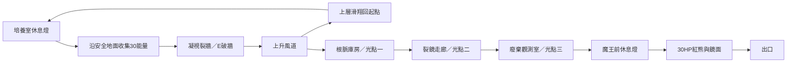

# 第一關改造：工程規格與階段交付

## 版本與範圍

- 已發布回復基線：`6785df1271fbf95a6286b221dccb5aaacbc79e48`。
- 改造分支：`feature/first-adventure-rework`；關卡版本 `adventure-2`，預設種子 2917。
- **依使用者後續指示，本輪只執行桌面實作與桌面驗收。手機與真實手機測試暫緩。**
- 沿用 Canvas、JavaScript、32px 地磚、既有角色精靈，不新增引擎或後端。
- `?legacy=1` 保留舊生成迷宮，供舊機制回歸；預設入口是新第一關。
- 10～15 分鐘是首次遊玩目標，尚未完成真人時間及難度驗收。

## 主線與固定事件

主線手工安排；三個主題區各有藏品、殘響支路。種子只改支路長度，不改必要事件位置。高低替代路、三個風道、五座休息燈與保護區在生成時確定。普通破牆不能破外框、受保護區或魔王邊界。入口仍以三光點判斷，不受地形破壞影響。

## 參數與介面

| 項目 | 首輪設定 |
|---|---|
| 敵人 | 水晶老鼠12、純史萊姆10、紫色大史萊姆3、樹妖3、初始青影鳥6、紅熊1 |
| 青影鳥 | 看見後啟動；同區每1.5秒增殖，上限6，離區暫停、清空停止 |
| 凝視 | 距離160px、持續0.6秒；上/下優先，否則依面向；最近目標優先 |
| 風場 | 向上加速度650px/s²，上升速度上限220px/s；下鍵抗風、不補翼能 |
| 近戰 | 現有0.32秒間隔、0.85秒連段窗口；第三段未按前進速度180、按住360px/s |
| 環境障礙 | 細根1階、纏枝2階、薄障礙3階；高階可清低階；光彈被阻擋 |
| 破牆 | 30能量；初段30枚，之後5點能量束；普通石牆需藏品 |
| 殘響 | 距離32px收集、顯示3秒、交戰時延後；三段故事可在暫停回看 |
| 鏡頭 | 垂直緩衝區總高15%、前視12%、方向延遲0.2秒、指數平滑；復活直接定位 |

`adventure.mjs` 產生兼容舊地形接口的世界，另提供版本、種子、區域查詢、主線、支路、物件及保護區。`exploration.mjs` 管理凝視、風道、清障、殘響、樹樁與鏡頭；碰撞沿用物理模組。`save.mjs` 負責有版本的單槽保存及失敗回報。環境動畫以遊戲時間驅動；暫停、失焦不推进遊戲。

所有主體敵人都有穩定 ID。大史萊姆子體以父 ID 加子體序號命名；青影鳥以巢區加序號命名，保存序號避免重複。

## 保存與死亡

保存鍵 `eye-creature.adventure.checkpoint`，格式版本1；同瀏覽器、同來源單槽，不是雲端同步。

- 玩家進入休息燈範圍時保存；首次補滿HP，再次進入不補血。離開範圍後可再次觸發保存。
- 保存種子、關卡版本、遊戲時間、生命與資源、能力、敵人與子體、收集、火炬、探索、破牆、風道、障礙、殘響、教學及魔王擊敗狀態。
- 續玩在存檔燈；存活敵人回出生點並維持保存生命。飛行彈、輸入、連段、受擊停頓與動畫不還原。
- 直接死亡保留本次進度，回燈補滿血；重新整理只恢復最後快照。死亡不立即覆寫存檔，回到燈後依進入规则保存。
- 進魔王房前保存出口燈快照；戰中重載回門前，魔王重新30HP。
- 新冒險需確認覆蓋；取消不改狀態。版本不符、資料損壞保留原字串；存取失敗顯示訊息，遊戲可繼續。

## 桌面介面與美術

探索時常駐HP、回血累積、光點、破牆資源、區域與目前攻擊類型。翼能、蓄力及連段靠近角色；只有一種魔法，切換按鈕隱藏。設定、收藏、殘響及完整操作集中於暫停面板。開場僅保留三句操作與目標，其他教學按首次情境出現。

地標分別使用破裂培養槽、纏根、鏡柱、望遠裝置。互動以形狀加色彩區分；風口格柵與箭頭、凝視進度、裂紋、破裂閃光及破後狀態可辨識。沿用像素角色，原創程序繪製環境與短音效；提供靜音、深淺色、減少動態。不是正式美術重製版本。

## 分階段交付（Codex／Claude Code共用）

1. 基線：確認乾淨工作目錄、建立改造分支、記錄回復版本；禁止直接推送main。
2. 操作：調整桌面資訊、鏡頭及第三段位移，驗證鍵盤和暫停行為。
3. 回環：完成首段資源、凝視、破牆、風道及返回起點；驗證實際碰撞路線。
4. 完整關卡：加入主題區、六支路、三光點、敵人、清障、殘響、藏品與紅熊。
5. 保存與呈現：還原地形、物件、敵人及收集，檢查錯誤存檔和配額失敗，整理教學及美術辨識。
6. 測試：100種子地形／資源檢查、跨FPS模型、桌面瀏覽器通關與舊模式回歸；真人部分獨立記錄。
7. 交付：更新工程規格、玩家說明、README、素材及驗收紀錄；本機試玩確認後才發布。

各階段先修復失敗檢查，再進下一階段。任何代理均不得將無傷導航、狀態注入測試或模型測試描述為真人手感驗收。
