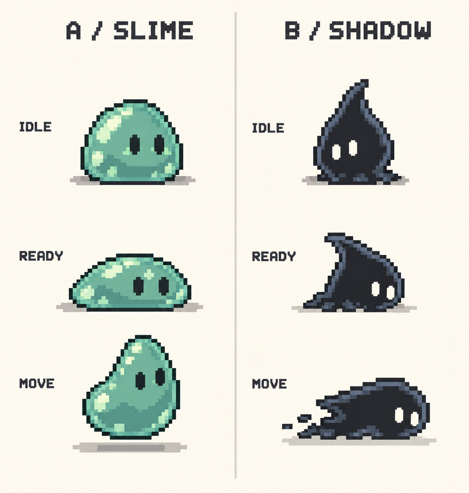

# 敵人像素概念 V1：史萊姆與黑影生物

> 最新設定請見 [V2：青影鳥、紅熊、老鼠屋與樹木怪](creatures-v2.md)。黑影提案已修正為保留影子特性的青影鳥；以下保留為歷史比較。

狀態：造型提案，尚未選定或接入遊戲。眼球怪動畫已由使用者確認完成，本次保留不動。

## 視覺比較

| 項目 | A：苔色史萊姆 | B：墨影生物 |
|---|---|---|
| 輪廓 | 圓頂、寬底的軟膠團 | 上尖下寬的短小影團 |
| 色彩 | 灰綠／青綠、少量淺色反光 | 炭黑、灰藍輪廓、米白雙眼 |
| 辨識 | 兩隻小眼，與主角的大單眼區分 | 兩隻小眼，無翅膀與長尾 |
| 移動提案 | 壓扁蓄力 → 小跳 → 落地回彈 | 縮身預備 → 貼地短滑 → 停住回復 |
| 攻擊預告 | 身體變寬、停一下再向前跳 | 向後縮、眼睛朝目標，再直線短衝 |
| 性格 | 呆萌、好奇、容易預判 | 調皮、神祕，但不恐怖 |
| 適合角色 | 第一種教學敵人 | 後續增加變化的敵人 |

## 建議先後順序

先做史萊姆：壓縮與跳躍的節奏容易看懂，也能與主角漂浮形成差異。黑影可保留為第二種敵人，以預告清楚的短衝製造變化。兩者皆先做可繞過的路上遭遇提案，維持探索與找出口的節奏；是否採用、碰撞規則及戰鬥數值待玩法整合時確認。

## 後續動畫規格草案

- 同主角使用 64×64 邏輯影格框；敵人本體暫以約 24–32px 寬設計，需在實際畫面比較後定稿。
- 最少需要待機、移動、攻擊預備／出招／回復、受擊與消散。概念圖僅展示待機、預備與移動三姿勢，不直接視為可播放影格。
- 起步以預備 400–600ms、短暫出招、回復 300–500ms 作為試玩參數，不是定案。
- 攻擊預告必須有輪廓和姿勢變化，不只依靠顏色或閃光。
- 黑影在深背景需有清楚的灰藍邊緣；史萊姆在淺背景需有深描邊。
- 無獠牙、血腥、寫實恐怖或密集閃爍。消散可用少量像素碎點。
- 先選角色，再製作實際尺寸動畫；本階段不改遊戲與主角動畫。

## 製作

使用內建 image_gen 生成概念對照圖。完整提示詞另存 prompts-v1.md。圖中姿勢和比例仍需在選定後統一，並驗證深淺背景、縮小辨識度及循環銜接。
