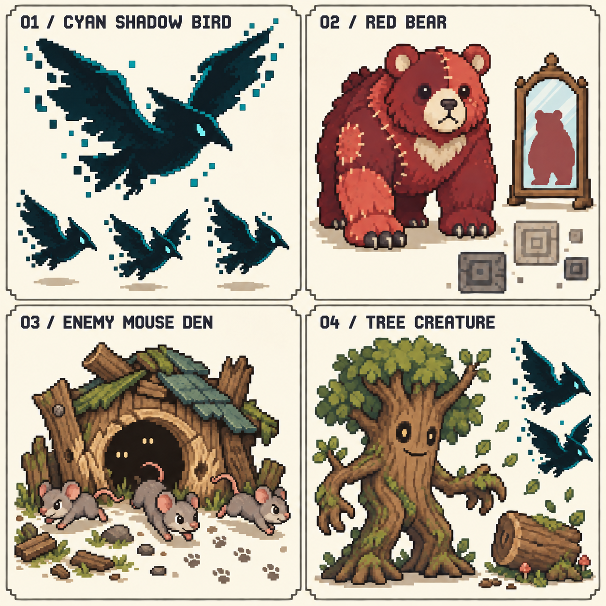

# 敵人與關卡物件 V2

狀態：角色與玩法設定稿；未修改遊戲程式。既有眼球怪動畫已確認完成，保留。原黑影生物修正為會飛的青影鳥，保留影子本質；史萊姆改為第一關水晶老鼠受擊後的第二階段。

概念圖用於比較造型，鏡子內熊影僅為鏡面符號，不代表實際解除演出。合成生物的構成與地圖顛倒效果尚待定義。[原版提示詞](prompts-v2.md)；[青影鳥修正提示詞](prompts-v3-shadow-bird.md)。

## 第一關已確認補充

第一關敵人是帶綠色水晶痕跡的老鼠。第一次受傷變成綠色史萊姆，第二次才消失。同一次攻擊不連續打掉兩階段。[第一關試玩](../../../index.html)。

主角背景：死亡勇者留下的器官，被魔王軍製成生物兵器。第一關的目標試玩長度為 10–15 分鐘，實際時間仍待測試。

## 已確認設定

| 對象 | 外形 | 功能／行為 |
|---|---|---|
| 青影鳥 | 青黑色鳥狀影體、會飛；保留影子的特性 | 放任不管會逐漸變多；砍倒樹木也會召喚青影鳥；玩家使用鏡面技能可使其攻擊自己 |
| 紅熊 | 紅色熊狀合成生物，小關卡魔王 | 施加「認知顛倒」：玩家看起來像小怪，小怪看起來像玩家；仍操控原角色 |
| 鏡子／鏡面技能 | 關卡鏡子物件，或玩家鏡面能力 | 兩者可破解紅熊的認知顛倒；鏡面技能另外可使青影鳥攻擊自己 |
| 老鼠屋 | 老鼠出沒的敵人巢穴 | 會跑出老鼠；不是友善休息據點 |
| 樹木怪 | 有生命的樹木怪物 | 存在於關卡；砍倒樹木會召喚青影鳥。樹木怪是否同樣算砍樹觸發，待確認 |

## 青影鳥：空中壓力

已確認：名稱為「青影鳥」，是鳥狀的影子生物，保留原黑影特性並能飛行。先前一般青色羽毛鳥的造型已作廢。

美術修正提案：青黑色影體、少量青色邊緣、細小亮眼；以尖喙、雙翼、短尾形成鳥狀剪影。翅膀像破碎影面，不畫成一般羽毛、主角的龍翼或觸手。尾緣與翼尖可飄散少量硬邊像素，主體仍保持清楚連接，不用大片煙霧遮住輪廓。去掉白肚、黃色鳥喙與笑眼，偏向安靜、警戒、略帶不安感。

動作提案：拍動影翼飛行、空中盤旋、短暫收攏影體預告俯衝、掠過後回旋。影子碎點只是視覺效果，不額外增加敵人數量。穿牆、無敵、隱形或怕光等能力尚未指定，不因影子設定自行加入。

兩種增加來源分開記錄：自然增殖／增援，以及砍樹召喚。具體是青影鳥繁殖、呼叫同伴，或區域生成尚未指定，先不固定故事解釋。

建議增加前用鳥鳴、影子或樹冠晃動預告。生成位置應在畫面邊緣或可見樹冠，不直接疊在玩家身上。增援間隔、一次數量、存活上限，以及清光後是否停止增加，都留待試玩定案，避免未經確認做成無限增生。

## 鏡面技能對青影鳥

已確認：玩家對青影鳥使用鏡面技能，會讓青影鳥攻擊自己。此處指青影鳥自身受攻擊，不擴寫為鳥群互相攻擊，也不是青影鳥施放鏡面技能。

演出提案：鏡面映出青影鳥 → 青影鳥撲向自己的倒影 → 自身受到攻擊。倒影是技能效果，不新增一隻可增殖的敵人。

技能影響範圍、可影響隻數、持續時間、自傷次數與傷害量尚待決定，不先設定為必殺。關卡中的實體鏡子是否也能對青影鳥產生同樣效果，尚未指定；目前只確認鏡面技能具備此用途。

## 紅熊：認知顛倒

外形提案：圓熊耳、寬鼻口、厚重熊掌，紅／暗紅／珊瑚色的不對稱拼接區塊表現合成感；不採血肉縫合。合成的具體來源尚未設定。

使用者已確認顛倒的是外觀與辨識，不是真正交換操控：

- 玩家仍控制原本角色，位置、移動輸入、生命、能力與實際陣營不交換。
- 玩家顯示為小怪；小怪顯示為玩家的眼球怪造型。紅熊自身是否也偽裝尚未指定。
- 建議保留玩家腳下小標記，讓孩子能追蹤正在控制的角色；敵人的出招預備仍可辨識。
- 接觸關卡鏡子，或使用鏡面技能，解除本次顛倒並恢復原外觀。是否有範圍、冷卻或持續免疫尚待設定。

「顛倒地圖」的具體方式仍待確認：目前只確定角色辨識顛倒，不將其擅自實作成地形翻轉、左右反向操作或重力倒轉。可以另外提案為地圖標記／場景視覺顛倒，但必須先確認。

建議紅熊施法前有明顯蓄力與鏡裂圖示，首次效果附近安排一定可達的關卡鏡子。鏡面技能可提供另一解法，避免未取得技能便無法破解。施法頻率和魔王戰勝利條件不在本輪定案。

## 老鼠屋：地面增援來源

確定為敵人巢穴，老鼠會从洞口跑出。外形建議：低矮洞屋、咬痕、鼠腳印及洞內成對眼睛，避免休息站招牌。出鼠前洞口抖動、露鼻子，再衝出；老鼠採低矮細長身體，與史萊姆的圓形輪廓區分。

尚待決定：巢穴能否破壞／封住、出鼠節奏、數量上限、玩家離開後如何處理。先不指定獎勵、商店或補血功能。

## 樹木怪與砍樹後果

樹木怪以樹皮臉、枝幹手臂、根部腳與樹冠表現。待機可像樹，攻擊前必須先睜眼或抬根，避免完全無預警。

已確認：只有近戰技能能砍樹。遠距射擊、投擲法術與鏡面技能不產生砍樹進度、不砍倒樹木，因此不會透過砍樹條件召喚青影鳥。判斷依技能類型，不依攻擊發動時距離；貼著樹射擊仍不算近戰。既有甩尾可作為近戰砍樹的候選技能，其他近戰招式尚未定案。

這條規則針對砍樹，不代表樹木怪自動免疫遠距傷害；樹木怪的受傷規則與倒下時是否召喚仍待確認。

砍倒樹木 → 樹冠響動／鳥鳴 → 青影鳥飛出，是建議的因果演出。普通樹木是否都能砍、樹木怪倒下是否也觸發、青影鳥一次出現幾隻仍待確認。不能自行把「每次命中樹木」當成召喚條件；目前指定的是「砍倒」。

## 下一輪驗證建議

先看角色實際尺寸的輪廓，之後依序做青影鳥飛行、老鼠出巢、樹木怪甦醒，以及紅熊施法與鏡子解除的短樣張。玩法整合維持探索與找出口，不加入需要停下來排機關的面板。

本稿中的「建議／提案／待確認」均非已核定規則。概念圖僅供美術審閱，不能當成正式動畫或完整戰鬥規格。
